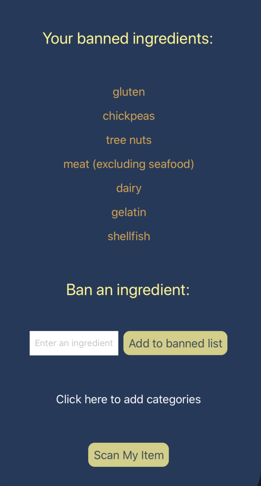

# Find-It

A cross platform mobile application that allows users to log in, add database persistent ingredients, and scan a food product’s barcode to detect those ingredients.

Built with React Native, Expo, Redux, AWS Amplify, AWS AppSync, GraphQL, DynamoDB, Open Food Facts API.

